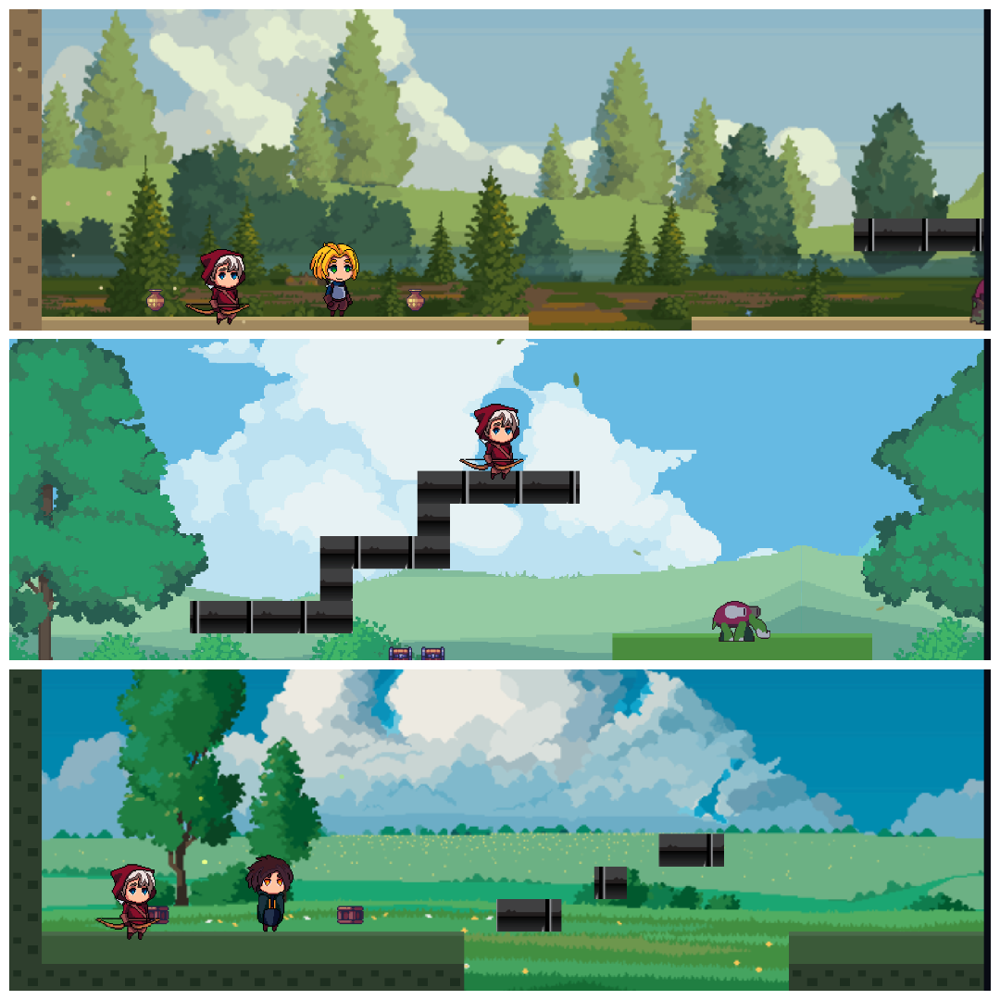

<div align="center">

# ~ V A N A V I E ~

### *Where the forest breathes and the journey begins*

---

</div>

<div align="center">
<!-- 
 -->


</div>

<br>

<div align="center">

<!--  -->

*VanaVie is a 2D side-scrolling adventure game built with the love for 2d Arcade Games. Checkout <a href="https://namansharma18899.github.io/VanaVie/" target="_blank">Live</a>* 

</div>

---

<br>

<table>
<tr>
<td width="50%">

### The World

Choose your traveler -- **Knight**, **Archer**, **Wizard**, or **Rogue** -- and step into a hand-crafted pixel world. Traverse tile-based landscapes with parallax skies, encounter enemies governed by state-machine AI, and uncover story triggers woven into every level.

</td>
<td width="50%">

### The Engine

Zero dependencies. No frameworks. Just the `<canvas>` element, `requestAnimationFrame`, and carefully layered systems: a smooth-follow camera, AABB collision, pooled audio, typewriter dialog, and fade-driven level transitions -- all in vanilla JS.

</td>
</tr>
</table>

<br>

## Features

| | |
|---|---|
| **Character Selection** | Four playable characters, each with unique stats and sprite animations |
| **Tile Map Engine** | Loads [Tiled](https://www.mapeditor.org/) JSON exports with background, terrain, collision, and foreground layers |
| **Camera System** | Lerp-smoothed follow camera with viewport culling and world bounds clamping |
| **State Machine AI** | Enemies patrol, chase, flank, and attack with configurable behaviors |
| **Story System** | Typewriter-style dialog boxes triggered from map objects, with one-shot support |
| **Combat** | Melee and ranged attacks, projectiles, HP, invincibility frames, knockback |
| **Level Transitions** | Fade-to-black transitions between maps via exit objects |
| **Audio** | Pooled sound effects with named registration, looping background music, mute toggle |
| **Parallax Backgrounds** | Multi-layer scrolling at different speeds relative to camera |
| **Level Editor** | Built-in browser-based editor for creating custom levels |

<br>

## Quick Start

```bash
# Clone the repo
git clone https://github.com/your-username/VanaVie.git
cd VanaVie

# Start any local file server
python -m http.server 8000

# Open in browser
open http://localhost:8000/start.html
```

<br>

## Controls

```
  W
A S D     Move & Jump         SPACE     Attack
                               E        Interact / Advance dialog
  P       Pause                M        Mute audio
  R       Restart (on death)   F1       Debug overlay
```

<br>

## Creating Levels

1. Design your map in [Tiled Map Editor](https://www.mapeditor.org/)
2. Use these layer conventions:
   - `background` -- decorative backdrop tiles
   - `terrain` -- visible ground and walls
   - `collision` -- solid tiles for physics
   - `foreground` -- tiles rendered above the player
   - Object layer with: `playerStart`, `enemy`, `story`, `exit` objects
3. Export as JSON to `maps/`
4. Place tileset images in `maps/tilesets/`

Or use the **built-in level editor** at `editor.html` to paint levels directly in the browser.

<br>

## Project Structure

```
start.html                  Character selection screen
index.html                  Game canvas
script.js                   Game loop & main Game class
editor.html                 Built-in level editor

game_stuff/                 Core engine systems
  state.js                    Base State class
  input.js                    Keyboard input handler
  camera.js                   Viewport camera with smoothing
  tileMap.js                  Tiled JSON map loader & renderer
  collision.js                AABB tile collision resolution
  layers.js                   Parallax background layers
  audioHandler.js             Sound effects & music manager
  levelManager.js             Level loading & transitions
  storyManager.js             Dialog & story trigger system
  hud.js                      Health bar & HUD overlay
  npc.js                      NPC entities & interaction

player_stuff/               Player entity
  player.js                   Player class with physics & combat
  projectile.js               Player projectiles

enemy_stuff/                Enemy entities
  enemy.js                    Base enemy with AI states
  enemyManager.js             Enemy spawning & lifecycle
  enemyStates.js              Enemy AI state machine

maps/                       Tiled JSON maps & tileset images
assets/                     Sprites, audio, backgrounds, UI
```

<br>

---

<div align="center">

*Built with nothing but JavaScript, a canvas, and a love for pixel art.*

</div>

---

<div align="center">
<video src="assets/screenshots/demo.mov" controls="controls" style="max-width: 100%;">
  Your browser does not support the video tag.
</video>
</div>